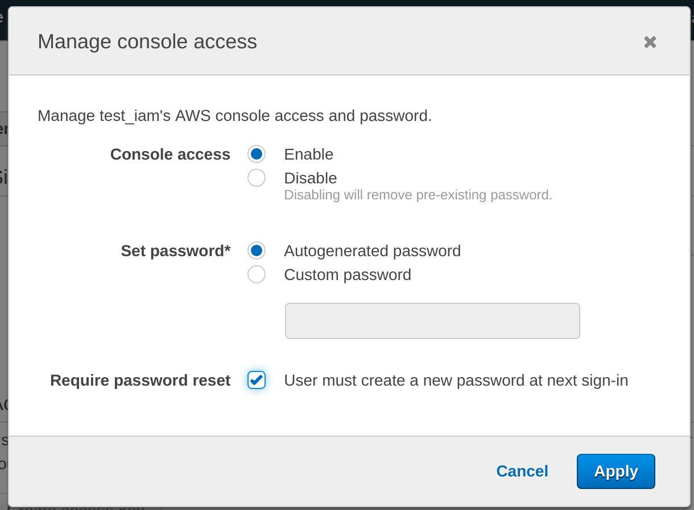

# IAM

Manage Data.gov sandbox access through Infrastructure as Code.


## Goals

- Manage IAM users and access using Infrastructure as Code
- Consolidate policy definitions in a single, easy to audit, location
- Manage both human users and machine accounts
- Automatically apply changes through GH workflow


## Features

- Enforce MFA on all human users
- Create machine accounts for continuous deployment
- New users can sign in with temporary password


## Usage

Changes are applied automatically through [continuous
deployment](https://github.com/GSA/datagov-iam/actions). As part of the PR
review, you should check that terraform plan includes only expected changes.

The `main` branch will automatically apply changes.


### New users

Create a new user module within `users.tf`. You can copy from an existing
resource. Make sure the user is in the `developers` group which enforces MFA.

```
module "firstname_lastname" {
  source  = "./user"
  name = "firstname.lastname@gsa.gov"
  groups = ["developers"]
}
```

Once applied, request that an admin  log into IAM to enable console access and set a temporary password
for the user.



At this point, the user can [login](https://datagov.signin.aws.amazon.com/console) with the temporary password. From the AWS
console, click their username -> My Security Credentials. They will have to
enable MFA and change their password before they can do anything else.

_Note: the new user may have to sign out and back in again._


### Removing a user

Remove the user's entry from `users.tf`.


## Development

### Requirements

- [Configure AWS Access Key](http://docs.aws.amazon.com/cli/latest/userguide/cli-chap-getting-started.html)
- [jq](https://stedolan.github.io/jq/)
- [awscli](https://docs.aws.amazon.com/cli/latest/userguide/install-cliv1.html)
- [terraform](https://www.terraform.io/downloads.html) v0.12

These tools are available through your package manager, or through pip.


### Setup AWS credentials

All developers are in the `developers` IAM group which enforces access through
multi-factor authentication (MFA). You must first get temporary credentials to
use with Terraform.

First, copy `env.sample` to `.env`, customize it with your AWS access key.
`AWS_MFA_DEVICE_ARN` should be set with your MFA arn. This can be found on the
"My Security Credentials" page in the AWS console. Then source these environment
variables.

    $ source .env

You'll be prompted for your MFA code. Enter it without any spaces when prompted.

These credentials are good for 12 hours.


## First-time setup

Create the s3 bucket (`datagov-terraform-state`) to hold the terraform state defined
in [main.tf](./main.tf).

Manually create the IAM CI deploy user (`datagov-ci`) for use with CI. An
appropriate terraform-managed policy will be attached to this user.

The first execution of `iam` should be done manually with admin permissions.

    $ terraform init
    $ terraform apply

Once provisioned, the appropriate permissions will be attached to the
`datagov-ci` user and execution of the other projects can be done via CI/CD.


## History

This repository was split out from [GSA/datagov-infrastructure-live](https://github.com/GSA/datagov-infrastructure-live).
